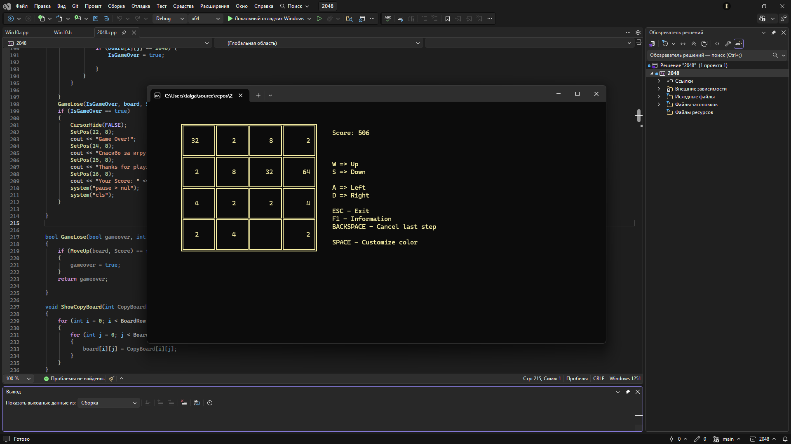

# Simple Console 2048 Game

A simple console version of the classic 2048 game, implemented in C++. Play directly in your terminal with keyboard controls.

## Screenshot



## Features

- Console-based gameplay
- Score tracking
- Intuitive keyboard controls (arrow keys)
- Tile merging logic similar to the original 2048

## Technologies

- C++
- Standard input/output
- Arrays and basic game logic

## How to Run

### Option 1: Using Visual Studio

1. Clone the repository:
```bash
git clone https://github.com/Involvee/Simple-Console-2048-game.git
```
2. Open Visual Studio.

3. Go to File → Open → Folder and select the cloned repository folder.

4. Open 2048.cpp (or your entry point file).

5. Press Ctrl + F5 to build and run the game.
